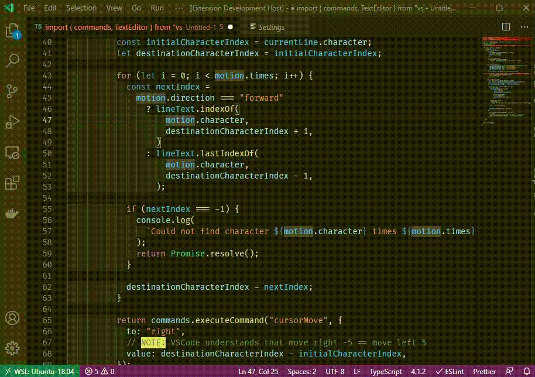

# Temporary vim motions

A VSCode extension that allows entering a temporary mode for moving around the code using supported
[vim motions](https://www.cs.auckland.ac.nz/references/gnu/vim/motion.html).

This makes it easier to intertwine regular VSCode nagivation with using vim's motions.

## Supported vim motions

- basic move up/down/right/left (`j`, `k`, `h`, `l`)
- next/previous character in line (`f`, `F`)
- start/end of the line (`$`, `^`)
- basic word motions (`w`, `e`, `b`)

When it makes sense, a number prefix (e.g. `2f{`) executes a motion given number of times.

## Features

- highlights the current position in the code
- temporarily enables relative line numbers to make navigation easier
- supports executing a motion multiple times (e.g. `15l`)
- when moving close to the top/bottom of the editor, shows surrounding lines

  

## Requirements

None

## Extension Settings

This extension contributes the following settings:

- `temporary-vim-motions.toggleRelativeLineNumbers`: enable/disable turning on relative line numbers
  when executing motions
- `temporary-vim-motions.surroundingLines`: number of surrounding lines to show when scrolling. If
  empty - the surrounding lines feature is disabled.

By default, there are no keyboard shortcuts for this command, so if you'd like, set a keybinding for
the `temporary-vim-motions.execute` command.

## Known Issues

Keep in mind that this extension does not offer full vim support. For that, you probably want to use
[vim](https://marketplace.visualstudio.com/items?itemName=vscodevim.vim) or
[Neo Vim](https://marketplace.visualstudio.com/items?itemName=asvetliakov.vscode-neovim) extensions

## Release Notes

See [the CHANGELOG](CHANGELOG.md).

## Contributing

Found a bug? Want a new feature/motion? Feel free to do any of the following:

1. Create an issue
2. Open a PR with a bugfix/feature

Contributions are greatly appreciated!
